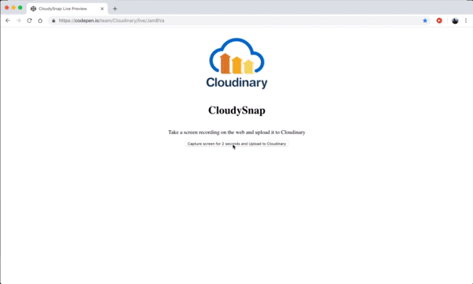
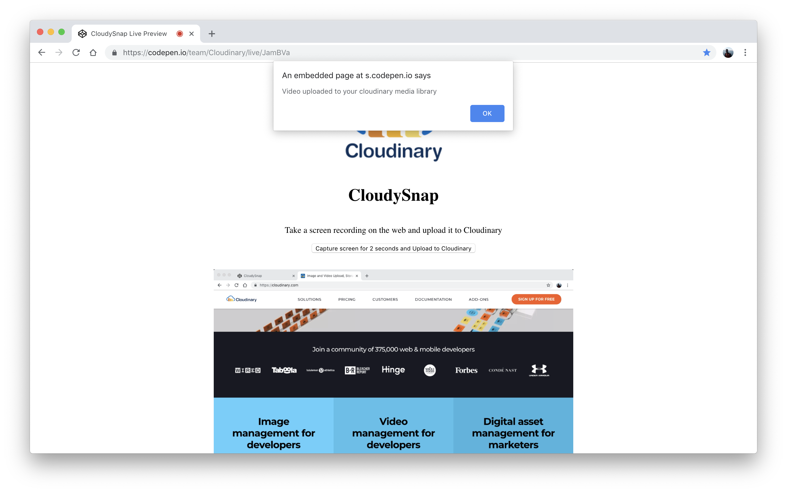
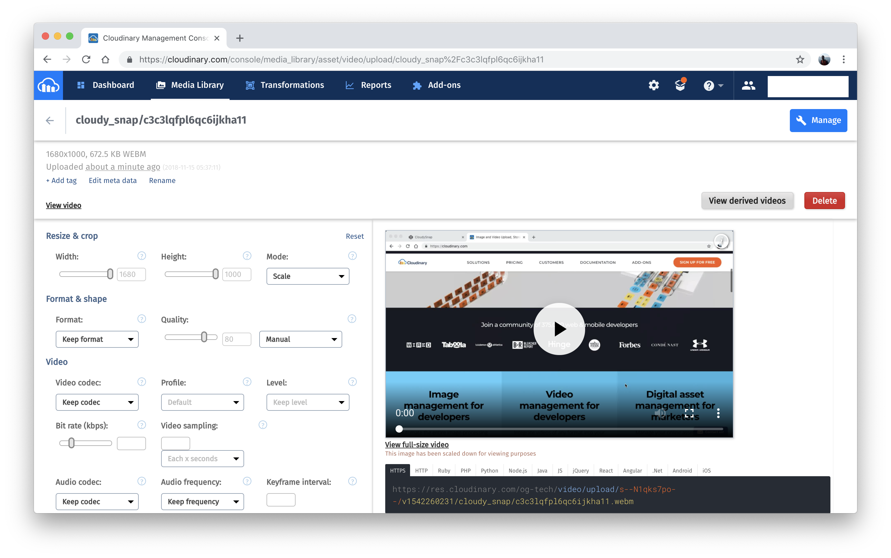

# Building a Simple Web Recorder with Cloudinary

## Prerequisites

- Enable [Experimental Web Platform Features on Chrome](chrome://flags/#enable-experimental-web-platform-features)

- Obtain free credentials from [Cloudinary](https://cloudinary.com) and create a [Cloudinary Upload Preset](https://cloudinary.gitbook.io/cloudysnap/connecting-web-screen-recorder-with-cloudinary)
